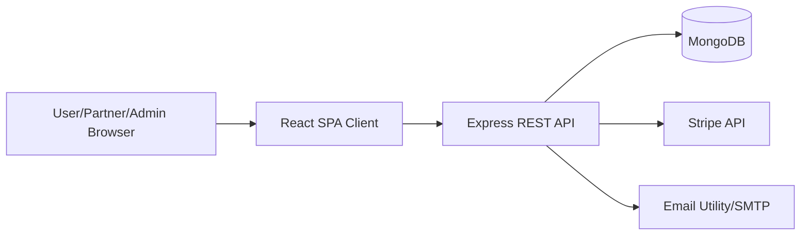
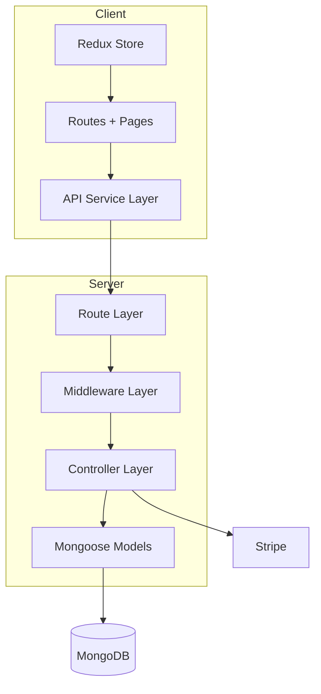
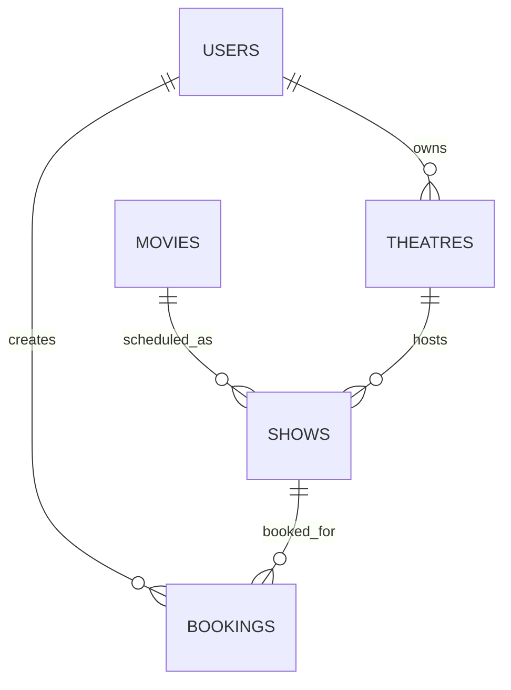
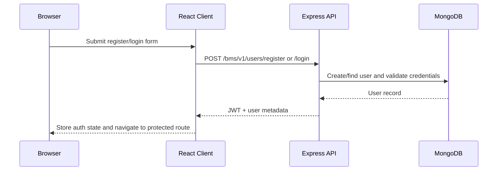

# BookMyShow Capstone – High-Level Design (HLD)

## 1) Purpose and Scope
This document describes the **high-level architecture** of the BookMyShow capstone project: how users, services, and core modules interact to support movie discovery, theatre/show management, and ticket booking with payment.

## 2) System Context

### 2.1 Actors
| Actor | Description | Key Capabilities |
|---|---|---|
| End User (`user`) | Customer booking tickets | Register/login, browse movies, select show & seats, pay, view bookings |
| Partner (`partner`) | Theatre owner/operator | Create theatre, add/update/delete shows, manage theatre data |
| Admin (`admin`) | Platform administrator | Manage movies, approve/block theatres |
| Payment Provider (Stripe) | External payment system | Creates and confirms payment intents |
| Email Service | Notification helper | Sends OTP and ticket-related email content |

### 2.2 Context Diagram

## 3) Architecture Overview

### 3.1 Technology Stack
| Layer | Technology |
|---|---|
| Frontend | React + Vite, React Router, Redux Toolkit, Ant Design |
| Backend | Node.js, Express |
| Database | MongoDB + Mongoose |
| Security | JWT auth, role-based authorization, Helmet, CORS, rate limiting, input validation |
| API Docs | OpenAPI + Swagger UI (`/bms/v1/docs`) |

### 3.2 Logical Architecture

### 3.3 Core Backend Modules
| Module | Responsibility |
|---|---|
| User Module | Registration, login, current user, forget/reset password, logout |
| Movie Module | CRUD for movies (admin write operations, authenticated read) |
| Theatre Module | Theatre onboarding and updates (partner/admin controls) |
| Show Module | Show schedule management and show discovery by theatre/movie |
| Booking Module | Payment intent creation, payment verification, atomic seat booking, user booking history |

## 4) HLD Data Relationships


## 5) Primary End-to-End Flows

### 5.1 Registration/Login + Protected Access


### 5.2 Booking Flow (Payment + Seat Lock)
```mermaid
sequenceDiagram
    participant U as User
    participant FE as React Client
    participant API as Express API
    participant ST as Stripe
    participant DB as MongoDB

    U->>FE: Select show + seats
    FE->>API: POST /bookings/createPaymentIntent
    API->>ST: Create PaymentIntent(amount)
    ST-->>API: clientSecret
    API-->>FE: clientSecret
    U->>FE: Confirm payment details
    FE->>ST: Confirm payment in frontend
    FE->>API: POST /bookings/makePaymentAndBookShow(paymentIntentId,seats)
    API->>ST: Verify payment status
    API->>DB: Atomically reserve seats + create booking
    DB-->>API: Booking success
    API-->>FE: Booking response
    FE-->>U: Navig

    ### 5.3 Theatre Onboarding/Approval Flow
```mermaid
flowchart LR
    P[Partner] -->|Add Theatre| API[POST /theatres/addTheatre]
    API --> T[(Theatre: isActive=false)]
    A[Admin] -->|Approve/Block| API2[PATCH /theatres/updateTheatre]
    API2 --> T2[(Theatre updated)]
```

## 6) Security and Operational Controls
| Concern | Current Design |
|---|---|
| Authentication | JWT token validation middleware |
| Authorization | Role-based access (`admin`, `partner`, `user`) |
| Validation | Joi schema validation through `validateRequest` middleware |
| API hardening | Helmet CSP, CORS restricted by `CLIENT_URL`, mongo-sanitize, rate limiter |
| Error handling | Centralized `errorHandler` middleware |
| API discoverability | Swagger at `/bms/v1/docs` |

## 7) Availability and Scalability Notes
| Topic | Design Consideration |
|---|---|
| Stateless API | JWT-based auth supports horizontal scaling of API instances |
| Database indexing | Indexes on movie language/genre/date and show/theatre relations improve read paths |
| Seat contention | Booking path designed with seat-locking checks before booking persistence |
| Deployment | Backend serves frontend build and SPA fallback for React Router |

## 8) Known Constraints / Improvement Opportunities
- `deleteTheatre` route currently has no explicit JWT/role middleware, so this should be tightened.
- Add centralized request tracing/correlation IDs for better observability.
- Add idempotency keys for booking API for retry safety.
- Add caching layer for high-read endpoints (`getAllMovies`, theatre/show discovery).

## 9) Project Folder Structure (High-Level)
```text
fullstack-capstone-project/
├── Client/                         # React + Vite frontend
│   ├── src/
│   │   ├── api/                    # API integration layer
│   │   ├── components/             # Reusable UI building blocks
│   │   ├── pages/                  # Route-level screens (Admin/Partner/User)
│   │   ├── redux/                  # Global state slices + store
│   │   ├── theme/                  # Theme context/provider
│   │   ├── test/                   # Frontend tests
│   │   └── assets/                 # Static assets
│   ├── public/
│   └── package.json
├── Server/                         # Node + Express backend
│   ├── config/                     # DB connection setup
│   ├── controllers/                # Request handlers/business logic
│   ├── middlewares/                # Auth, role, validation, error middleware
│   ├── models/                     # Mongoose schemas/models
│   ├── routes/                     # API route definitions
│   ├── validators/                 # Joi validation schemas
│   ├── utils/                      # AppError, email helper/templates
│   ├── Docs/                       # OpenAPI + domain flow docs
│   ├── test/                       # Backend tests
│   └── server.js                   # App bootstrap
├── HLD/
│   └── HLD.md
├── LLD/
│   └── LLD.md
└── BookMyShow.postman_collection.json
```

---
# LLD Reference
Detailed module-level design is provided in `LLD/LLD.md`.
