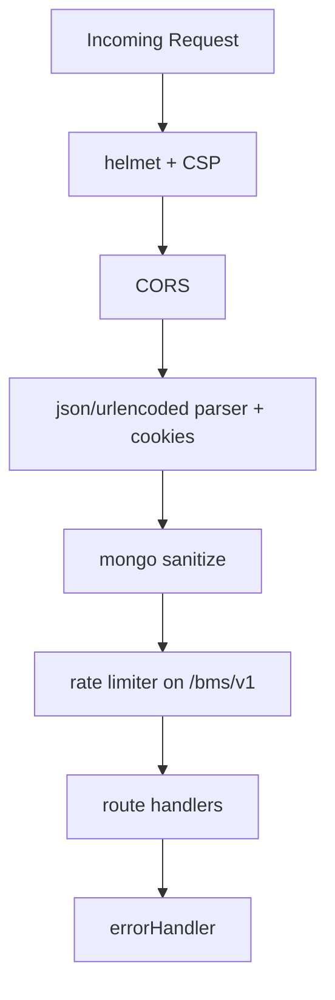
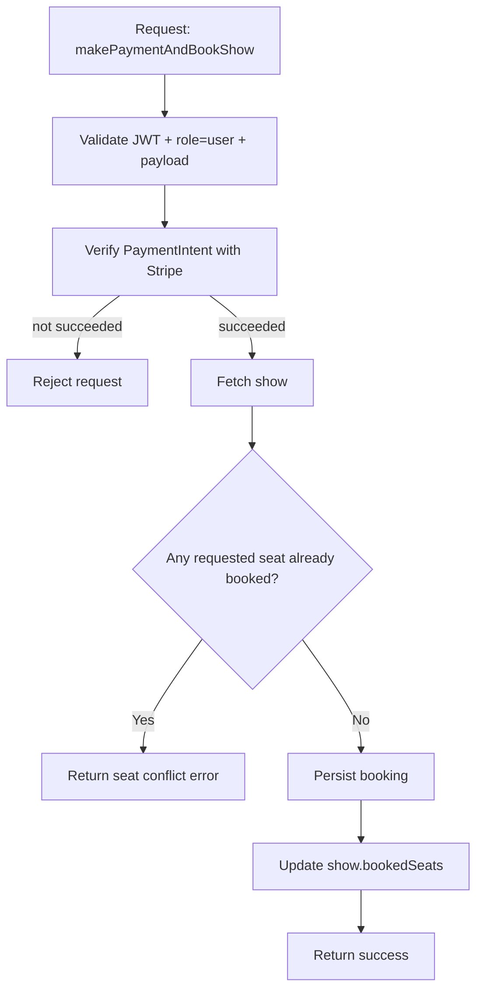
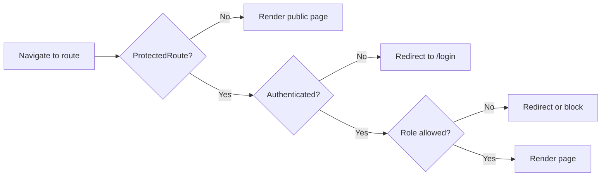

# BookMyShow Capstone – Low-Level Design (LLD)

## 1) Objective
This document captures implementation-level details for the current codebase: route-level behavior, middleware chains, data models, frontend structure, and critical flows.

## 1.1 Project Folder Structure (Detailed)
```text
fullstack-capstone-project/
├── Client/
│   ├── src/
│   │   ├── api/
│   │   │   ├── index.js
│   │   │   ├── user.js
│   │   │   ├── movie.js
│   │   │   ├── theatre.js
│   │   │   ├── show.js
│   │   │   └── booking.js
│   │   ├── components/
│   │   │   └── ProtectedRoute.jsx
│   │   ├── pages/
│   │   │   ├── Admin/
│   │   │   ├── Partner/
│   │   │   ├── Home.jsx
│   │   │   ├── SingleMovie.jsx
│   │   │   ├── BookShow.jsx
│   │   │   ├── MyBookings.jsx
│   │   │   ├── Login.jsx
│   │   │   ├── Register.jsx
│   │   │   ├── Forget.jsx
│   │   │   ├── Reset.jsx
│   │   │   └── BookingSuccess.jsx
│   │   ├── redux/
│   │   │   ├── store.js
│   │   │   ├── userSlice.js
│   │   │   └── loaderSlice.js
│   │   ├── theme/
│   │   │   ├── ThemeProvider.jsx
│   │   │   └── themeContext.js
│   │   ├── test/
│   │   ├── App.jsx
│   │   └── main.jsx
│   └── package.json
├── Server/
│   ├── config/
│   │   └── db.js
│   ├── controllers/
│   ├── middlewares/
│   ├── models/
│   ├── routes/
│   ├── validators/
│   ├── utils/
│   │   └── email_templates/
│   ├── Docs/
│   │   ├── openapi.js
│   │   ├── ER.md
│   │   └── Flows/
│   ├── test/
│   └── server.js
├── HLD/HLD.md
├── LLD/LLD.md
└── BookMyShow.postman_collection.json
```

## 2) Backend LLD

### 2.1 Express Bootstrap and Middleware Pipeline



### 2.2 Route Groups and Access Control

#### User Routes (`/bms/v1/users`)
| Endpoint | Method | Auth | Role | Purpose |
|---|---|---|---|---|
| `/register` | POST | No | Public | Create new user |
| `/login` | POST | No | Public | Authenticate user |
| `/getCurrentUser` | GET | Yes | Any authenticated | Fetch logged-in user profile |
| `/forgetPassword` | POST | No | Public | Trigger OTP/password reset initiation |
| `/resetPassword` | POST | No | Public | Reset password using verification |
| `/logout` | POST | No (current impl) | Public | Logout action |

#### Movie Routes (`/bms/v1/movies`)
| Endpoint | Method | Auth | Role | Purpose |
|---|---|---|---|---|
| `/getAllMovies` | GET | Yes (app-level) | Any authenticated | List movies |
| `/movie/:id` | GET | Yes (app-level) | Any authenticated | Movie details |
| `/addMovie` | POST | Yes | Admin | Add movie |
| `/updateMovie` | PATCH | Yes | Admin | Update movie |
| `/deleteMovie/:movieId` | DELETE | Yes | Admin | Delete movie |

#### Theatre Routes (`/bms/v1/theatres`)
| Endpoint | Method | Auth | Role | Purpose |
|---|---|---|---|---|
| `/addTheatre` | POST | Yes | Partner | Add theatre |
| `/updateTheatre` | PATCH | Yes | Admin or Partner | Update theatre / approval state |
| `/deleteTheatre/:theatreId` | DELETE | Route currently unguarded | N/A | Delete theatre |
| `/getAllTheatres` | GET | Yes (app-level) | Any authenticated | List all theatres |
| `/getAllTheatresByOwner` | GET | Yes (app-level) | Any authenticated | Partner-specific theatres |

#### Show Routes (`/bms/v1/shows`)
| Endpoint | Method | Auth | Role | Purpose |
|---|---|---|---|---|
| `/addShow` | POST | Yes | Partner | Add show |
| `/updateShow` | PATCH | Yes | Partner | Update show |
| `/deleteShow/:showId` | DELETE | Yes | Partner | Delete show |
| `/getAllShowsByTheatre/:theatreId` | GET | Yes (app-level) | Any authenticated | Shows in theatre |
| `/getAllTheatresByMovie` | POST | Yes (app-level) | Any authenticated | Theatres showing movie on date |
| `/getShowById/:showId` | GET | Yes (app-level) | Any authenticated | Show details |

#### Booking Routes (`/bms/v1/bookings`)
| Endpoint | Method | Auth | Role | Purpose |
|---|---|---|---|---|
| `/createPaymentIntent` | POST | Yes | User | Create Stripe PaymentIntent |
| `/getAllBookings` | GET | Yes | User | Booking history |
| `/makePaymentAndBookShow` | POST | Yes | User | Verify payment + reserve seats + create booking |

### 2.3 Request Validation Matrix
| Domain | Validator |
|---|---|
| Users | `registerSchema`, `loginSchema`, `forgetPasswordSchema`, `resetPasswordSchema` |
| Movies | `movieSchema` |
| Theatres | `theatreSchema` |
| Shows | `showSchema` |
| Bookings | `createPaymentIntentSchema`, `bookingSchema` |

### 2.4 Data Model Design

| Collection | Key Fields | Relationships | Notable Constraints/Indexes |
|---|---|---|---|
| `users` | `name`, `email`, `password`, `role`, `otp`, `otpExpiry` | 1:N with theatres and bookings | Unique email, role enum, password excluded by default |
| `movies` | `movieName`, `description`, `duration`, `genre[]`, `language[]`, `releaseDate`, `poster` | 1:N with shows | Unique movieName, indexes on `language`, `genre`, `releaseDate` |
| `theatres` | `name`, `address`, `phone`, `email`, `owner`, `isActive` | N:1 owner(user), 1:N with shows | Index on owner |
| `shows` | `name`, `date`, `time`, `movie`, `ticketPrice`, `totalSeats`, `bookedSeats[]`, `theatre` | N:1 movie, N:1 theatre, 1:N bookings | Seat validation, indexes on `date`, `movie`, `(movie,date)`, `theatre`, `bookedSeats` |
| `bookings` | `show`, `user`, `seats[]`, `transactionId`, `amount`, `currency`, `paymentStatus` | N:1 show, N:1 user | Unique immutable `transactionId`, index on user and `(show,seats)` |

### 2.5 Booking Algorithm (Seat Reservation Path)



## 3) Frontend LLD

### 3.1 Route Structure
| Route | Guard | Component |
|---|---|---|
| `/` | Protected (any authenticated user) | `Home` |
| `/mybookings` | Protected (`user`) | `MyBookings` |
| `/admin` | Protected (`admin`) | `Admin` |
| `/partner` | Protected (`partner`) | `Partner` |
| `/movie/:id` | Protected | `SingleMovie` |
| `/book-show/:id` | Protected | `BookShow` |
| `/login` | Public | `Login` |
| `/register` | Public | `Register` |
| `/forget` | Public | `Forget` |
| `/reset` | Public | `Reset` |
| `/booking-success` | Public (reachable after payment flow) | `BookingSuccess` |

### 3.2 Frontend Component Interaction
```mermaid
flowchart TB
    APP[App.jsx]
    APP --> ROUTER[BrowserRouter + AppRoutes]
    ROUTER --> PR[ProtectedRoute]
    ROUTER --> PAGES[Public Pages]
    APP --> THEME[ThemeProvider/useTheme]
    ROUTER --> STORE[Redux loader/user slices]
    PAGES --> API[api/*.js service modules]
    API --> BACKEND[/bms/v1/*]
```

### 3.3 API Client Layer
| File | Responsibility |
|---|---|
| `src/api/user.js` | Auth endpoints and current user interactions |
| `src/api/movie.js` | Movie listing/details/admin movie operations |
| `src/api/theatre.js` | Theatre add/list/update/delete operations |
| `src/api/show.js` | Show CRUD and discovery operations |
| `src/api/booking.js` | Payment intent and booking submission |
| `src/api/index.js` | Shared axios/base configuration |

### 3.4 Auth & Role Guard Flow


## 4) Error Handling Strategy
| Layer | Mechanism |
|---|---|
| Validation | Reject invalid payloads before controllers |
| Controller | Throws/forwards operational errors |
| Middleware | `errorHandler` formats unified response |
| Frontend | Error mapping utility + user-facing messages |

## 5) Test Coverage Snapshot
| Area | Example Test Files |
|---|---|
| Middleware | `authorizationMiddleware.test.js`, `validateRequest.test.js`, `errorHandling.test.js` |
| Validators | `validators.test.js` |
| Integration | `integrationRoutes.test.js` |
| Frontend API and state | `userApi.integration.test.js`, `reduxSlices.test.js`, `errorMapper.test.js` |

## 6) Suggested Next-Step LLD Enhancements
- Add transaction/session support where multi-document consistency is critical.
- Move booking seat update to single atomic DB operation with strict conflict checks.
- Enforce consistent auth middleware at route declaration level (remove accidental public mutations).
- Introduce service layer separation to reduce controller complexity.