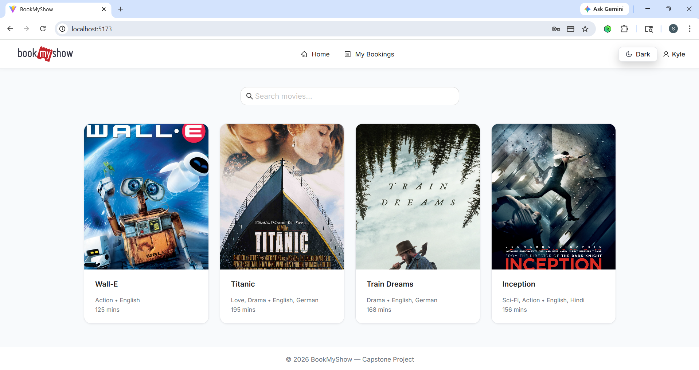
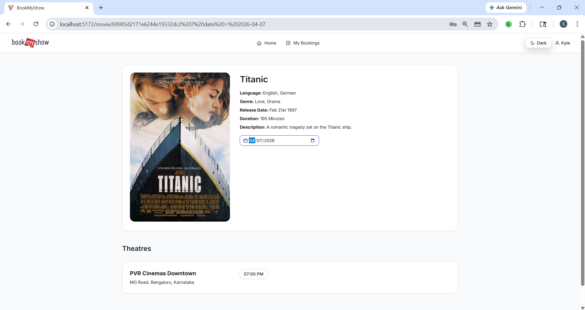
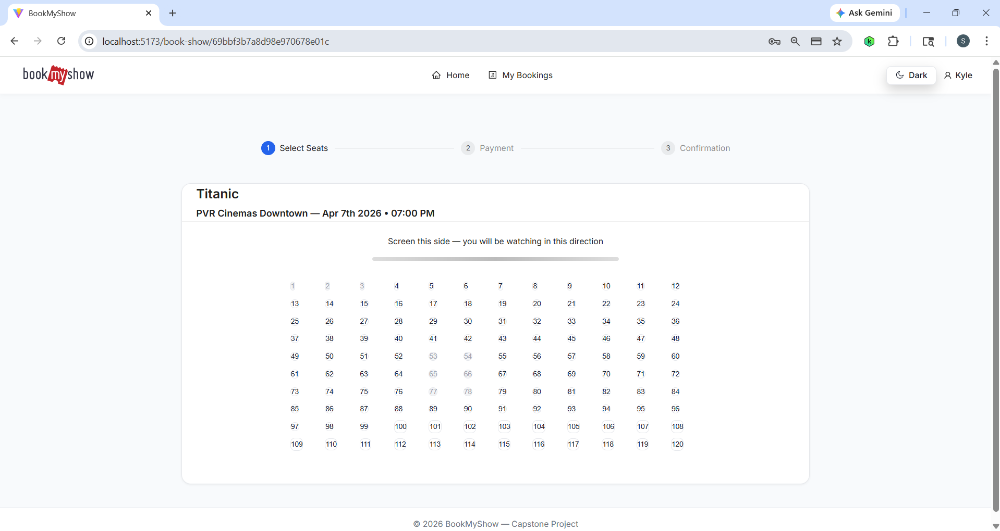
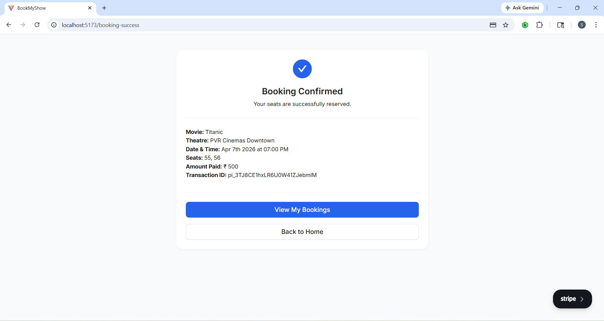

# 🎬 BookMyShow Capstone Project

[](https://react.dev/)
[](https://nodejs.org/)
[](https://www.mongodb.com/)
[](https://stripe.com/)
[](https://vitejs.dev/)

A robust, full-stack movie ticket booking platform inspired by BookMyShow. This project was developed as a capstone project, focusing on secure payment integration, role-based access control (RBAC), and scalable MERN architecture.

---

## 🔗 Project Links

- **Live Demo:** [View Live Site](https://fullstack-capstone-project-o3s2.onrender.com)
- **Interactive API Docs:** [Swagger Documentation](https://fullstack-capstone-project-o3s2.onrender.com/bms/v1/docs/)

---

## 🖼️ Visual Preview

### Full App Flow


### Key Interfaces
| Home Page | Movie Details |
| :--- | :--- |
|  |  |

| Seat Selection | Payment Success |
| :--- | :--- |
|  |  |

---

## 🚀 Core Features

### 👤 User Capabilities
- **Browse & Filter:** Search for movies and view detailed descriptions, ratings, and trailers.
- **Booking Engine:** Interactive seat selection with real-time UI updates.
- **Secure Payments:** Integrated **Stripe PaymentIntent** for seamless ticket purchasing.
- **Account Security:** OTP-based "Forgot Password" flow and profile-specific booking history.

### 🛡️ Admin & Partner Controls (RBAC)
- **Admin:** Management of global movie catalogs and verification of theatre partners.
- **Partner:** Manage theatre screens, schedule shows, and track ticket availability.

### 🔐 Technical Highlights
- **JWT Authentication:** Secure sessions using `httpOnly` cookies to mitigate XSS attacks.
- **Data Integrity:** Schema validation via **Zod** and database sanitization to prevent NoSQL injection.
- **Resilience:** Implemented API rate limiting, Helmet security headers, and centralized global error handling.

---

## 🏗️ Tech Stack

### Frontend
- **Framework:** React 19 + Vite
- **State Management:** Redux Toolkit (RTK)
- **UI Components:** Ant Design (AntD)
- **Networking:** Axios

### Backend
- **Runtime:** Node.js + Express 5
- **Database:** MongoDB + Mongoose ODM
- **Validation:** Zod
- **Documentation:** Swagger (OpenAPI 3.0)

---

## 📁 Project Structure

```text
fullstack-capstone-project/
├── Client/                  # React + Vite Frontend
│   ├── src/
│   │   ├── api/             # API service layers
│   │   ├── redux/           # Global state slices
│   │   ├── pages/           # View components (Admin, Partner, User)
│   │   └── components/      # Shared UI (ProtectedRoutes, Navbar)
├── Server/                  # Node.js + Express Backend
│   ├── controllers/         # Business logic handlers
│   ├── models/              # Mongoose database schemas
│   ├── middlewares/         # Auth, RBAC, and Security
│   ├── validators/          # Zod schema definitions
│   └── routes/              # API endpoint definitions
├── HLD/                     # High-Level Design & Architecture
└── docs/                    # Media assets and screenshots

```

## ✅ Prerequisites

- Node.js 18+
- npm 9+
- MongoDB connection URI (local or Atlas)
- Stripe account (test keys are fine for local development)
- Gmail app password (for OTP email delivery)

```

## ⚙️ Environment Variables

Create `Server/.env`:

```env
PORT=5000
MONGO_URI=<your_mongodb_connection_string>
SECRET_KEY=<your_jwt_secret>
CLIENT_URL=http://localhost:5173
STRIPE_KEY=<your_stripe_secret_key>
GMAIL_USER=<your_gmail_address>
GMAIL_APP_PASSWORD=<your_gmail_app_password>
NODE_ENV=development

```

> The backend exits at startup if `PORT`, `SECRET_KEY`, or `MONGO_URI` are missing.

## 🧪 Local Development Setup

### 1) Install dependencies

```bash
cd Server && npm install
cd ../Client && npm install
```

### 2) Run backend

```bash
cd Server
npm start
```

Backend runs on `http://localhost:5000` (or your configured `PORT`).

### 3) Run frontend

```bash
cd Client
npm run dev
```

Frontend runs on `http://localhost:5173` by default.

## 🧭 API Overview

Base prefix: `/bms/v1`

- `POST /users/register`
- `POST /users/login`
- `GET /users/getCurrentUser`
- `POST /users/forgetPassword`
- `POST /users/resetPassword`
- `POST /users/logout`
- `GET /movies/getAllMovies`
- `POST /bookings/createPaymentIntent`
- `POST /bookings/makePaymentAndBookShow`
- `GET /bookings/getAllBookings`

For interactive API documentation, open:
- `GET /bms/v1/docs`

You can also import:
- `BookMyShow.postman_collection.json`

## 🧪 Testing

### Backend tests

```bash
cd Server
npm test
```

### Frontend tests

```bash
cd Client
npm test
```

## 📚 Design Documents

- `HLD/HLD.md` for architecture-level documentation
- `Server/Docs/` for flow-level docs and OpenAPI setup

## 🤝 Contributing

1. Fork / branch from main branch
2. Make changes with clear commit messages
3. Run relevant tests
4. Open a PR with a summary and test evidence


## 📄 License

This project is for educational/capstone use. Add a formal license if you plan to open-source it publicly.
