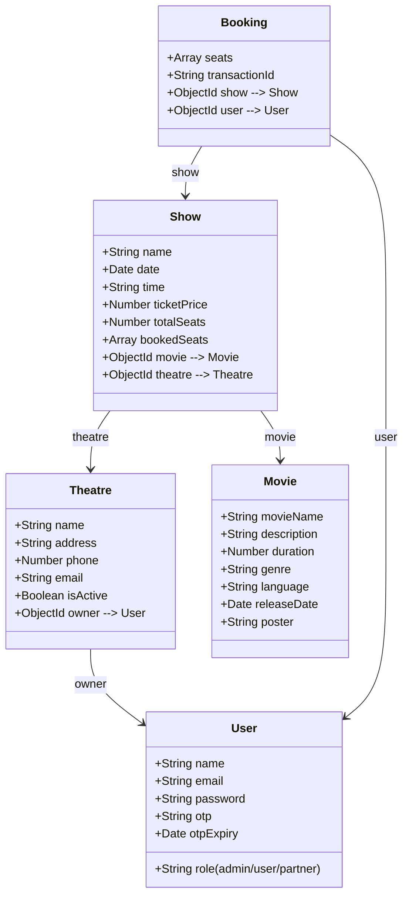

```mermaid
classDiagram
  class User {
    +String name
    +String email
    +String password
    +String role (admin/user/partner)
    +String otp
    +Date otpExpiry
  }

  class Theatre {
    +String name
    +String address
    +Number phone
    +String email
    +Boolean isActive
    +ObjectId owner --> User
  }

  class Movie {
    +String movieName
    +String description
    +Number duration
    +String genre
    +String language
    +Date releaseDate
    +String poster
  }

  class Show {
    +String name
    +Date date
    +String time
    +Number ticketPrice
    +Number totalSeats
    +Array bookedSeats
    +ObjectId movie --> Movie
    +ObjectId theatre --> Theatre
  }

  class Booking {
    +Array seats
    +String transactionId
    +ObjectId show --> Show
    +ObjectId user --> User
  }

  %% Relationships
  Theatre --> User : owner
  Show --> Movie : movie
  Show --> Theatre : theatre
  Booking --> Show : show
  Booking --> User : user
```
