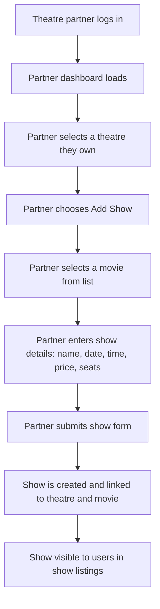

```mermaid
flowchart TD
  A[Theatre partner logs in] --> B[Partner dashboard loads]
  B --> C[Partner selects a theatre they own]
  C --> D[Partner chooses Add Show]
  D --> E[Partner selects a movie from list]
  E --> F[Partner enters show details: name, date, time, price, seats]
  F --> G[Partner submits show form]
  G --> H[Show is created and linked to theatre and movie]
  H --> I[Show visible to users in show listings]
```
