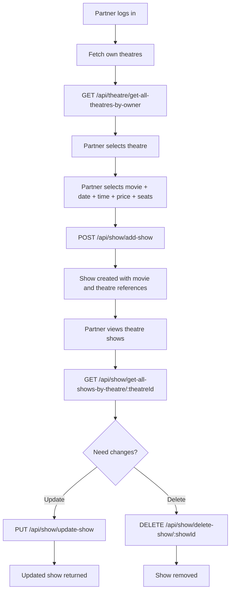

# Add / Manage Show Flow (Partner)

## Key implementation updates

- Show stores seat inventory via `totalSeats` and runtime lock state via `bookedSeats`.
- Show queries heavily use `movie`, `date`, and `theatre` for discovery and filtering.
- Theatre-specific show listing populates movie details for partner dashboard UX.