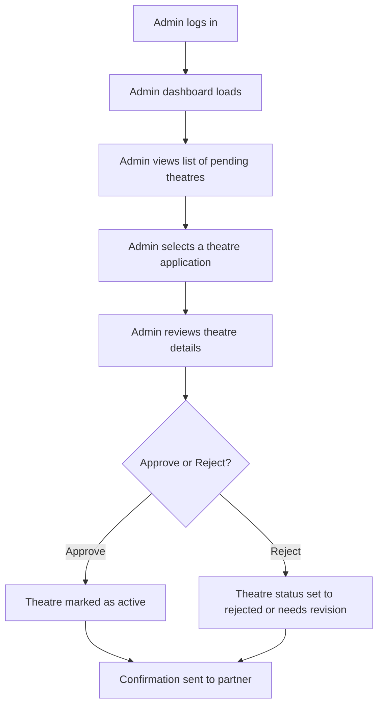

```mermaid
flowchart TD
  A[Admin logs in] --> B[Admin dashboard loads]
  B --> C[Admin views list of pending theatres]
  C --> D[Admin selects a theatre application]
  D --> E[Admin reviews theatre details]
  E --> F{Approve or Reject?}
  F -- Approve --> G[Theatre marked as active]
  F -- Reject --> H[Theatre status set to rejected or needs revision]
  G --> I[Confirmation sent to partner]
  H --> I
```
