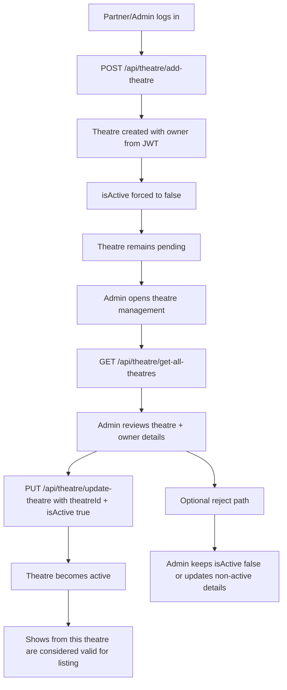

# Admin Approves a Theatre Flow

## Key implementation updates

- Theatre `owner` is always derived from authenticated user (not trusted from client body).
- Partners cannot self-approve because partner-side update strips `isActive`.
- Admin can activate theatre through update endpoint.