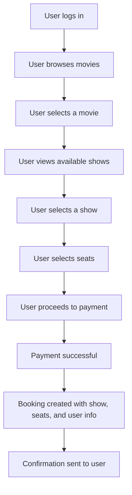

```mermaid
flowchart TD
A[User logs in] --> B[User browses movies]
B --> C[User selects a movie]
C --> D[User views available shows]
D --> E[User selects a show]
E --> F[User selects seats]
F --> G[User proceeds to payment]
G --> H[Payment successful]
H --> I[Booking created with show, seats, and user info]
I --> J[Confirmation sent to user]
```
