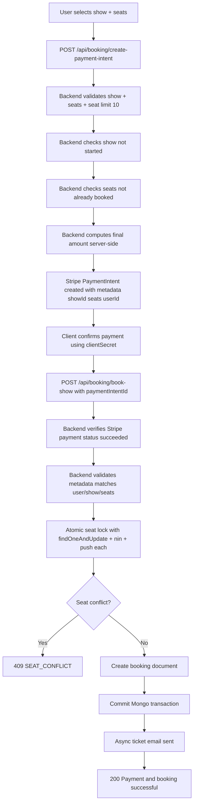

# Book a Movie Flow (Stripe + Atomic Seat Lock)

## Key implementation updates

- Pricing is trusted only from backend (`seats * show.ticketPrice * 100`).
- Transaction idempotency uses unique `transactionId = paymentIntentId`.
- Seat allocation uses atomic DB update to prevent double booking under concurrency.
- Booking stores payment amount and status for audit/refund workflows.