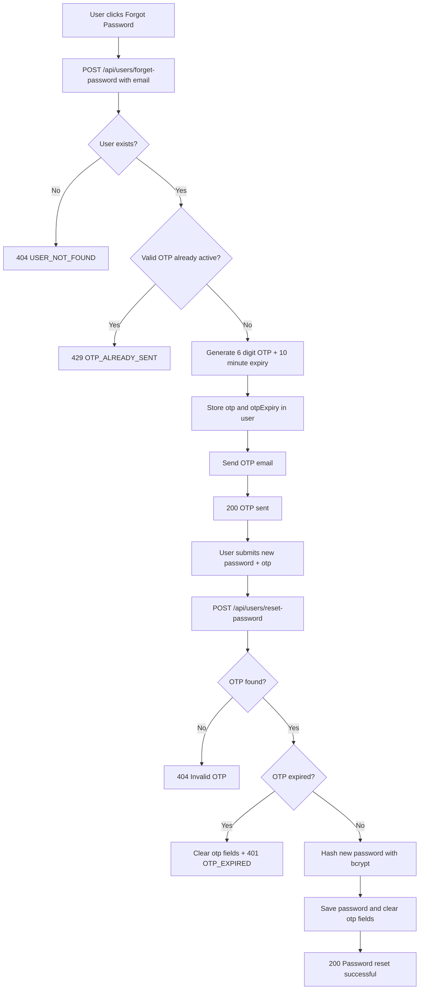

# Forgot Password / Reset Password Flow

## Key implementation updates

- OTP replay protection blocks repeated OTP requests within valid window.
- OTP and password reset operations are always done on server side.
- OTP data is cleared on expiry and successful reset.