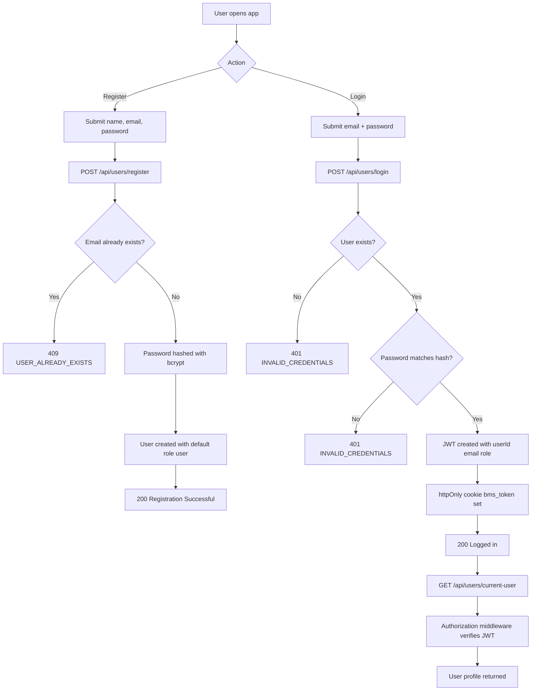

# User Registration and Login Flow

## Key implementation updates

- Authentication token is stored in `bms_token` cookie (`httpOnly`, `sameSite=lax`).
- JWT payload includes `userId`, `email`, and `role` for role-based access control.
- Password is always hashed before persistence; plain passwords are never stored.