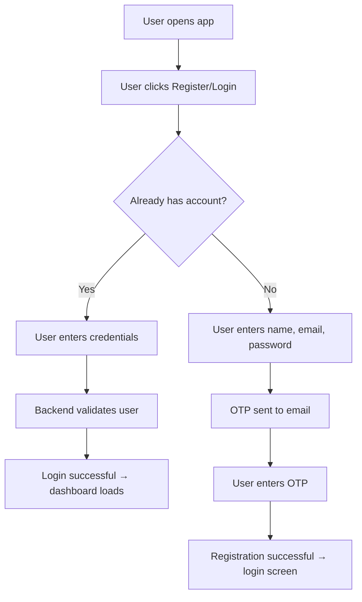

```mermaid
flowchart TD
  A[User opens app] --> B[User clicks Register/Login]
  B --> C{Already has account?}
  C -- Yes --> D[User enters credentials]
  D --> E[Backend validates user]
  E --> F[Login successful → dashboard loads]
  C -- No --> G[User enters name, email, password]
  G --> H[OTP sent to email]
  H --> I[User enters OTP]
  I --> J[Registration successful → login screen]
```
